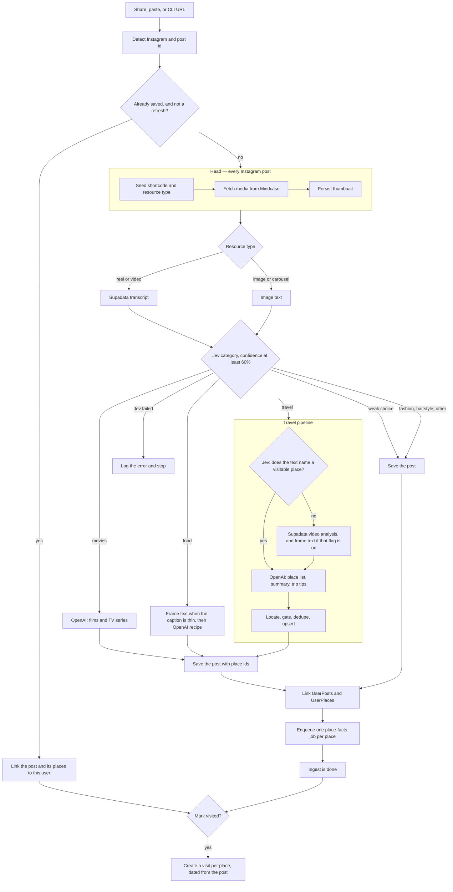

# Instagram ingest flow

```mermaid
flowchart TD
  url["Share, paste, or CLI URL"] --> check["Detect Instagram and post id"]
  check --> cached{"Already saved, and not a refresh?"}
  cached -->|yes| linkOnly["Link the post and its places to this user"]
  cached -->|no| head

  subgraph head ["Head — every Instagram post"]
    seed["Seed shortcode and resource type"]
    fetch["Fetch media from Mindcase"]
    thumb["Persist thumbnail"]
    seed --> fetch --> thumb
  end

  head --> tail{"Resource type"}
  tail -->|reel or video| transcript["Supadata transcript"]
  tail -->|image or carousel| image["Image text"]
  transcript --> category
  image --> category

  category{"Jev category, confidence at least 60%"}
  category -->|weak choice| savePost
  category -->|Jev failed| stopped["Log the error and stop"]
  category -->|travel| travel
  category -->|movies| movies["OpenAI: films and TV series"]
  category -->|food| food["Frame text when the caption is thin, then OpenAI recipe"]
  category -->|fashion, hairstyle, other| savePost["Save the post"]

  subgraph travel ["Travel pipeline"]
    named{"Jev: does the text name a visitable place?"}
    named -->|yes| places
    named -->|no| analysis["Supadata video analysis, and frame text if that flag is on"]
    analysis --> places["OpenAI: place list, summary, trip tips"]
    places --> mentions["Locate, gate, dedupe, upsert"]
  end

  movies --> save
  food --> save
  mentions --> save["Save the post with place ids"]
  save --> library["Link UserPosts and UserPlaces"]
  savePost --> library
  library --> facts["Enqueue one place-facts job per place"]
  facts --> done["Ingest is done"]
  linkOnly --> optional
  done --> optional{"Mark visited?"}
  optional -->|yes| visit["Create a visit per place, dated from the post"]
```
